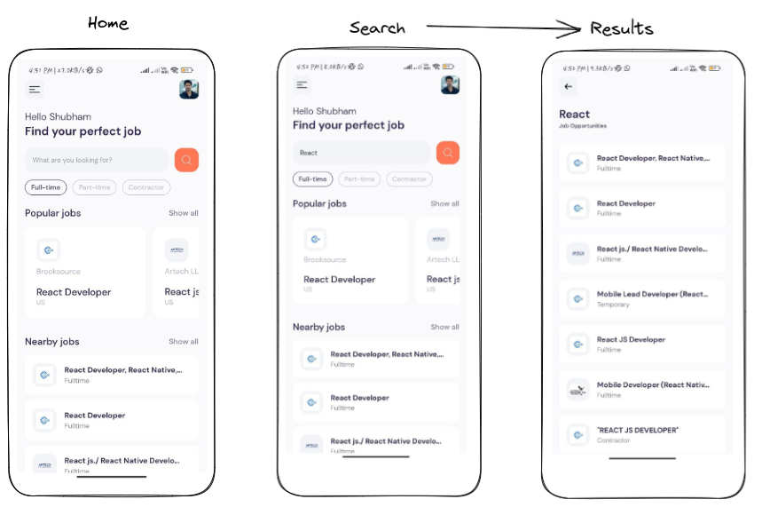
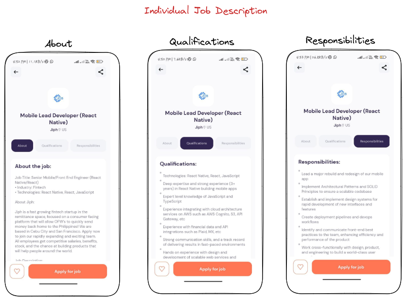

# React Native-powered Job Finder Application

JobFinder is a mobile application built using React Native that allows users to search and apply for jobs from a variety of sources. The app uses a modern and intuitive user interface to provide an easy-to-use job search experience.

### Screenshots :

### Test this app in your local machine:

Prerequisites

- Install Node.js and npm on your computer. You can download them from
  the official website: https://nodejs.org/en/download/.
- Install Expo CLI globally by running the following command in your
  terminal: npm install -g expo-cli.

Steps to run the app

- Clone the JobFinder React Native app from the GitHub repository to
  your local machine using the command git clone
  https://github.com/ShubhamSKadam/JobFinder_React_native.git.

- Navigate to the project directory using the command cd  
  JobFinder_React_native.

- Install the app's dependencies using the command npm install.

- Launch the app by running the command expo start. This will start the
  Expo server and launch the app in a web browser.

- From the Expo server, you can launch the app on your physical device
  or on an emulator. To launch the app on a physical device, install  
  the Expo app on your device from the app store, and scan the QR code
  generated by the Expo server. To launch the app on an emulator,  
  select the emulator option from the Expo server.

Note: The app requires API keys for some of its features to function properly.
To get your API key,

1. Create an account over rapidapi.com.
2. Search for Jsearch API.
3. Navigate to endpoint and copy your API key from the console.
